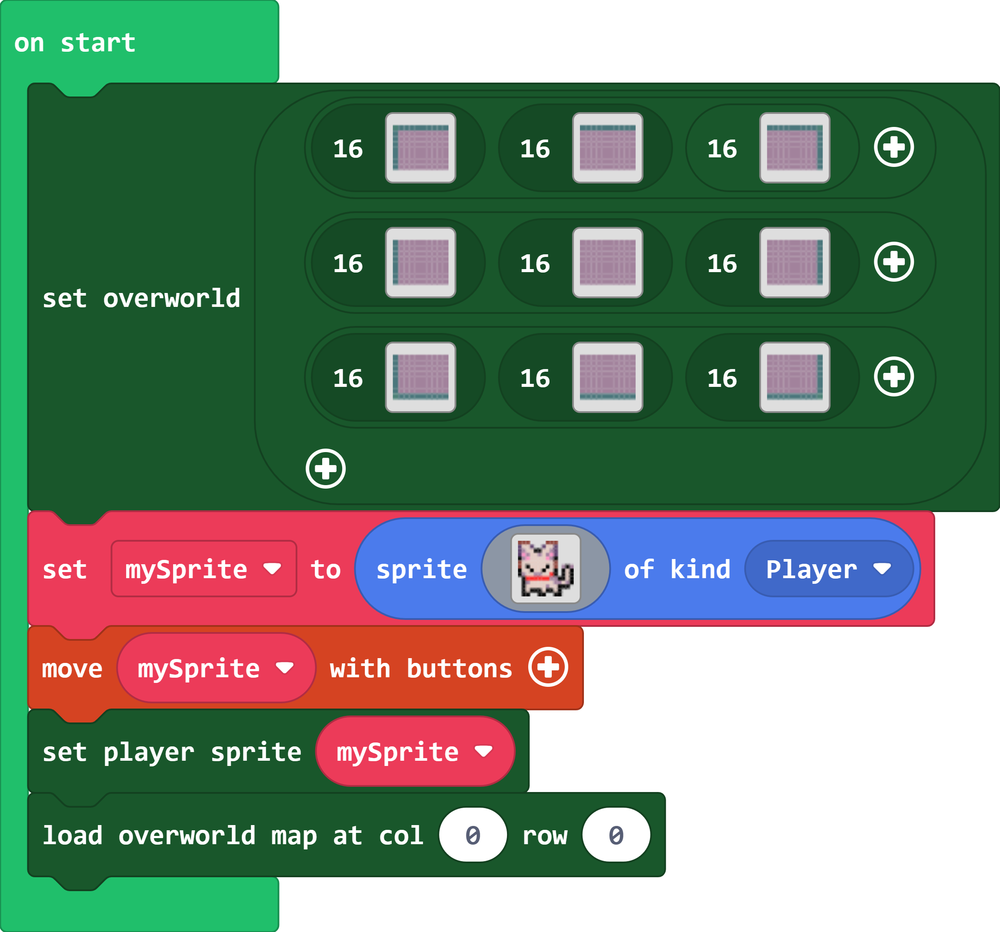
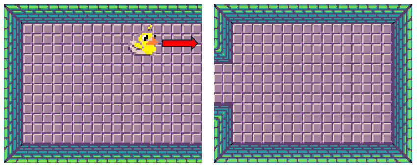
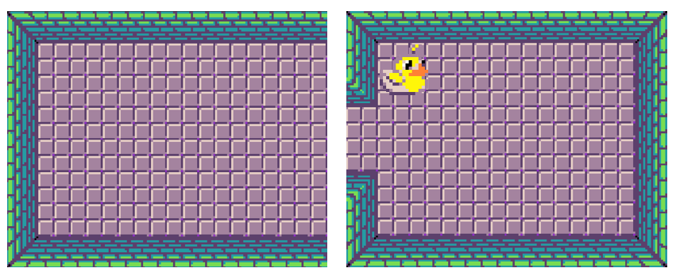

# arcade-overworld

A MakeCode Arcade extension for connecting multiple tilemaps in a grid. For example, you could use this extension to make a dungeon crawling game with multiple rooms. Overworld makes it super easy to transition between tilemaps, all you need to do is set which sprite should act as the player sprite and the extension will handle the rest!

>As of February 2025, there is a known bug where the overworld blocks in the toolbox don't populate their arguments correctly. As a result, you need to drag the shadow blocks from the "Shadows" section of the toolbox to fill in the rows for the overworld tilemap. This will be fixed in the next version of Arcade

[Here's a basic example](https://makecode.com/_7bc4wCTCVWby)

## Transitioning between maps

The overworld extension will automatically load the next map whenever the player sprite approaches the edge of the current map. You can control how far away from the edge the player needs to be for the transition to start by using the "set transition radius" block.

By default, overworld will try and find the closest non-wall tile in the map being loaded and place the player sprite there. For example, let's say we had a situation like this:

When the duck sprite moves to the tilemap on the right, it will be placed in the first column available after the wall like so:

If tilemaps in the overworld are different sizes, the sprite will still be moved to the closest unoccupied place. For example:

In the above example, the duck is bumped up to the bottom of the destination tilemap. Note how the tilemaps are treated as if they are aligned on the top. For vertical transitions, tilemaps are aligned on the left.

### Block map transitions with walls

Alternatively, you can use the "set walls block map transitions" block to make it so that the player is blocked from moving to the map if there is a wall blocking the way in the destination map. If the player sprite is larger than one tile, the sprite will only be allowed to transition between maps if it can completely fit in the corresponding location between maps.

For example:

In the above diagram, the top duck would be blocked from moving between tilemaps because there is a wall in the destination tilemap that blocks its path. The lower duck is not blocked, so the tilemaps will transition as normal.

If one of the maps is larger than the other, the player sprite will also be blocked from moving to the next tilemap if it is outside the bounds of the destination map:

## Animating tilemap transitions

Overworld supports a few different ways of animating the transition between tilemaps. By default, there is no animation and tilemap transitions happen instantly.

Your game is temporarily frozen while an animation plays. As a result all animating sprites will appear frozen until the animation completes. Be careful when using the pause block in your code if you have animations enabled; if a pause ends while the game is still frozen, it might lead to bugs!

### Scroll

The scroll animation causes the camera to pan between the two tilemaps when transitioning. It's great for mimicking that old NES and SNES style of map transitions!

### Fade to white/black/custom

The various fade animations will cause the screen to fade to a color before loading the next map.

When playing these animations, the overworld extension will always use whatever palette is set in the project settings. As a result, these animations are *not* compatible with the color-fading extension.

### Timing functions

You can set the timing function for animations to control how the animation plays out. Try experimenting with all of the functions in the dropdown and see what they do! Setting the animation duration to longer will make it easier to tell what each one does.

## Continuous mode

In addition to transitioning between discrete tilemaps, you can also put the overworld into "continuous mode" which will cause all of your tilemaps to be stitched together into one giant tilemap.

[Continuous mode example](https://makecode.com/_LdDLux0vqRqz).

> Note: to use continuous mode, all tilemaps in the overworld need to have the exact same width and height! They also need to use the same tile size; no mixing 16x16 and 8x8 tiles!

Continuous mode can be useful if you want to make tilemaps that are larger than the maximum tilemap dimensions. You can also use this to bypass the limit of 255 tiles per tilemap, but that might cause some bugs so I wouldn't recommend it!

You might also use continuous mode if you want to reuse tilemaps inside of a bigger map. For example, if you were procedurally generating a dungeon you might want to use the same map for all of your hallways between rooms.

When using continuous mode, the animation and transition blocks are disabled since there is no switching between tilemaps. However, you can still use the "on map loaded" event to figure out when the player moves between tilemaps. Likewise, the "overworld location" block will still return the column/row of the current sprite.

## Procedurally generating dungeons

The overworld extension is great for procedurally generating dungeons! The argument being passed to the "set overworld" block is actually just a double array of tilemaps, so you can create your own randomly generated tilemap using arrays. Each index in the outer array represents a row in the overworld and each index in the inner arrays represents a column.

I'll try to add a procedurally generated sample program to this README soon!